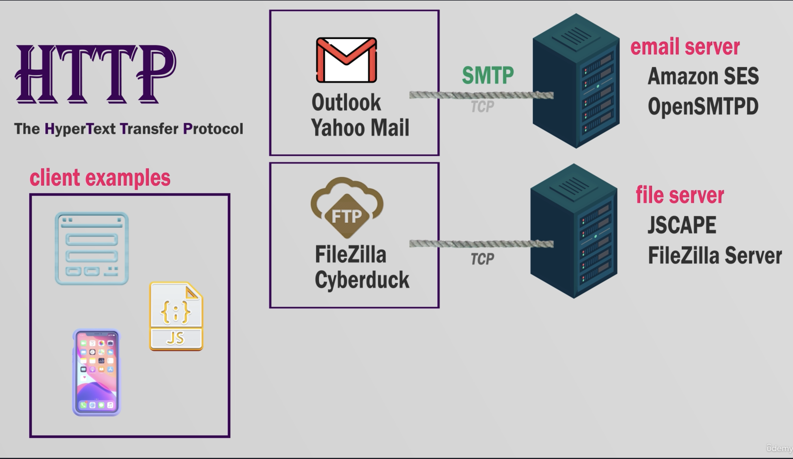
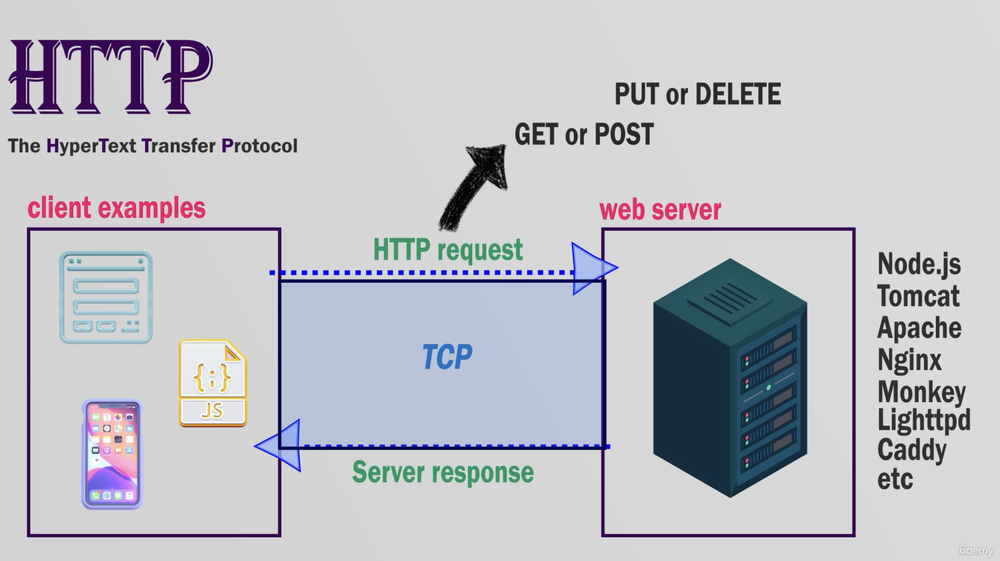
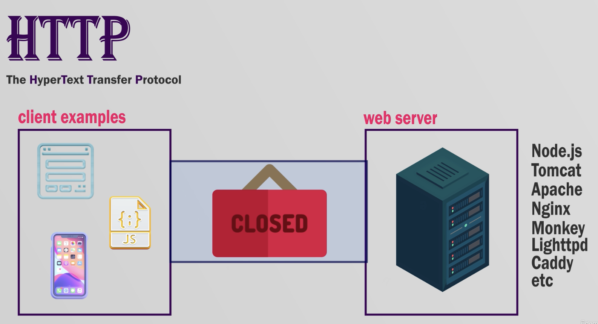
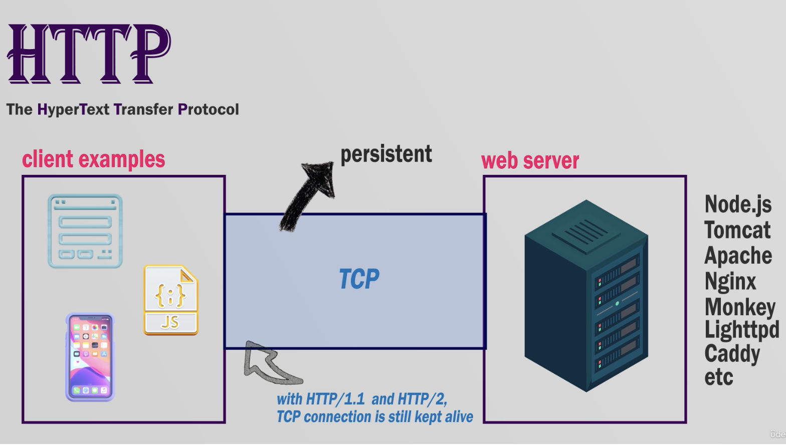
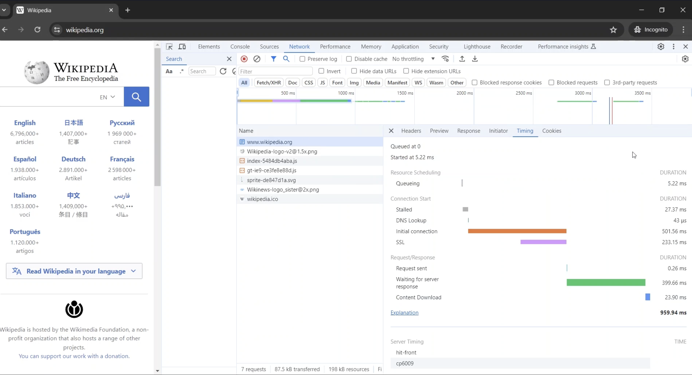
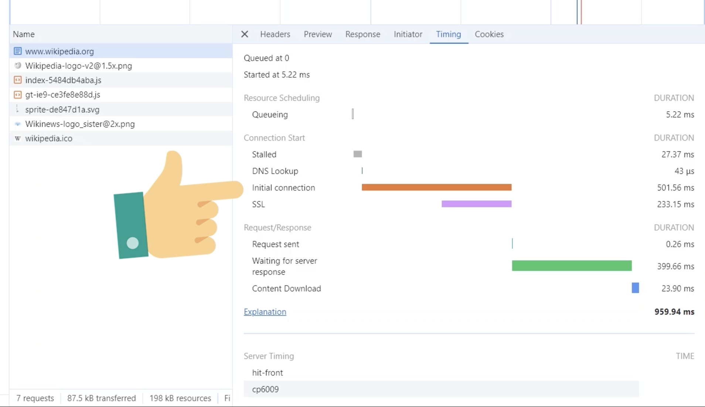
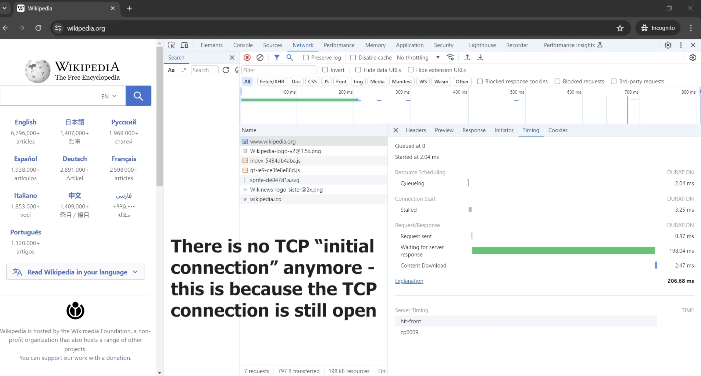

# Web Protocols and TCP Connections Overview

## 1. Client-Server Model Overview

- **Request-Response Model:**  
  Originally, web apps followed a simple model where the client (e.g., web browser) sends an HTTP request and the server processes and returns a response.

- **Diverse Clients:**  
  Beyond browsers, various types of clients exist:
  - **Email Clients:**  
    Applications like Gmail, Outlook, Apple Mail, Thunderbird, etc., communicate with mail servers to retrieve, send, and manage emails.
  - **File Transfer Clients:**  
    Tools like FileZilla, Cyberduck, and WinSCP interact with file servers (e.g., FTP servers) for uploading, downloading, and managing files.
  - **Mobile Apps & JavaScript Files:**  
    These also function as web clients, interacting with web servers to deliver content and services.

## 2. Protocols and Their Specific Roles

- **TCP (Transmission Control Protocol):**

  - Establishes a tunnel (or connection) between the client and the server.
  - It is essential for any data transmission regardless of the type of client.

- **Application Layer Protocols:**
  - **HTTP (HyperText Transfer Protocol):**  
    Governs the transfer of web pages.
  - **SMTP (Simple Mail Transfer Protocol):**  
    Governs the sending of email messages.
  - **FTP (File Transfer Protocol):**  
    Governs the structured transfer of files.

## 3. The Role of TCP Connections in HTTP

- **Initial Connection Setup:**  
  Before any HTTP request/response can occur, a TCP connection must be established between the client and the server.

- **HTTP/1.0 vs. HTTP/1.1:**
  - **HTTP/1.0:**  
    Opened a new TCP connection for each HTTP request, then closed it immediately after the response. This method was inefficient due to the repeated connection setup and teardown.

- **HTTP/1.1:**  
  Introduced persistent (keep-alive) TCP connections, meaning the same connection remains open and can handle multiple HTTP requests/responses, thereby improving performance by eliminating repeated DNS lookups and connection handshakes.

## 4. Observing TCP Connection Persistence

- **Browser Developer Tools:**

  - When visiting a webpage (e.g., wikipedia.org) and inspecting the network tab:
    - The first request includes a DNS lookup and connection time (TCP handshake).
    - Subsequent requests to the same server omit these steps, confirming the persistence of the TCP connection.

- **Asynchronous Operations:**  
  Modern web apps utilize Ajax and promises to send and receive HTTP requests in the background, ensuring the user experience is not interrupted.

## 5. Deeper Inspection with Wireshark

- **Packet-Level Analysis:**  
  For a more detailed examination of how data is transmitted over a TCP connection, tools like Wireshark can capture and display individual packets. This provides insights beyond what browser developer tools can show.

## 6. Key Takeaways

- **Multiple Clients & Protocols:**  
  Various clients (web, email, file transfer) rely on specific protocols to communicate with their corresponding servers.
- **TCP as the Foundation:**  
  Every communication, whether for web pages, emails, or file transfers, requires a TCP connection.
- **Efficiency via Persistence:**  
  HTTP/1.1’s use of persistent TCP connections optimizes performance by keeping the connection open for multiple requests.
- **State vs. Session:**  
  Although HTTP is stateless (each request/response is independent), sessions are maintained through mechanisms like cookies.

---

_This document encapsulates the key concepts and details discussed regarding the evolution of web protocols, the significance of TCP connections, and the improvements made from HTTP/1.0 to HTTP/1.1._
